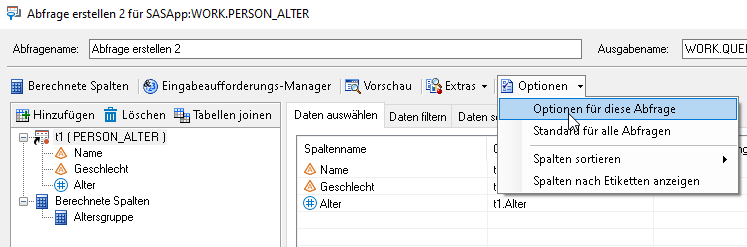

Umgang mit grossen Datenmengen
==============================

* * *

Bei der Arbeit mit sehr grossen Datenmengen kann es zu Ressourcen- bzw. Speicherproblemen kommen. Um dem entgegenzuwirken gibt es einige einfache Möglichkeiten.

Output komprimieren
-------------------

Abfragen im SAS Enterprise Guide können um diverse Optionen ergänzt werden:  
Optionen -> Optionen für diese Abfrage -> Ergebnisse 

Im Feld `Optionen:` kann SQL-Code eingegeben werden. In diesem Fall `compress=yes`. Dies führt dazu, dass der Output der Abfrage komprimiert wird und weniger Speicherplatz auf dem SAS-Server in Anspruch nimmt. Zudem sollte die Abfrage so auch schneller durchlaufen. 

Löschen mit PROC DATASETS
-------------------------

Nicht mehr benötigte Datensätze brauchen unnötig Speicherplatz im WORK-Verzeichnis und sollten deshalb gelöscht werden. Zum Beispiel: Wenn mehrere Datensätze durch einen Merge zu einem neuen Datensatz zusammengefügt werden, können nach dem Merge die ursprünglichen Datensätze gelöscht werden.

> proc datasets lib=work;  
> delete dataset1 dataset2 dataset3;  
> run;

Dieser Ansatz ist eher für SAS-Projekte mit Programmierung geeignet, kann aber theoretisch auch mit vordefinierten Abfragen und Anwendungsroutinen des SAS Enterprise Guide kombiniert werden. Dazu einfach den Code in ein Programm schreiben, rechter Mausklick auf den zu löschenden Datensatz und «Verknüpfen mit» und das Programm mit dem Proc Datasets-Statement auswählen.

WICHTIG: Beim Schliessen des SAS Enterprise Guide werden alle Daten im WORK-Verzeichnis gelöscht. Das Löschen mittels Proc Datasets ist also nicht bei jedem noch so kleinen SAS-Projekt nötig. Wichtig ist es eher bei sehr grossen Projekten mit vielen Abfragen bzw. Programmen und mit grossen Datensätzen.

Effiziente Sortierung
---------------------

Das Sortieren von Datensätzen kann vor allem bei grossen Datensätzen sehr ressourcenintensiv sein. Es gibt zwei Ansätze um sowohl Zeit als auch Speicherplatz einzusparen.

Das Proc Sort-Statement um die Option TAGSORT ergänzen:

> proc sort data=person **tagsort**;  
> by alter;  
> run;

Wenn nur ein Subset eines Datensatzes sortiert werden soll, wird das oft in zwei Schritten gemacht:

> data person\_f (where=(geschlecht="F"));  
> set person;  
> run;
> 
> proc sort data=person\_f out=person\_f\_sorted;  
> by alter;  
> run;

Ein Kombinieren dieser beiden Schritte spart sowohl Zeit als auch Speicherplatz:

> proc sort data=person (where=(geschlecht="F")) out=person\_f\_sorted;  
> by alter;  
> run;

Auswahl und Filter
------------------

Aus jeder Abfrage resultierte ein neuer Datensatz, der im WORK-Verzeichnis gespeichert wird. Je kleiner dieser ist, desto schneller läuft die Abfrage durch und desto weniger Speicher wird im WORK-Verzeichnis in Anspruch genommen. Deshalb sind folgende zwei Grundsätze wichtig:

*   Auswahl der Variablen: So früh wie möglich nur noch mit den relevanten Variablen arbeiten. Am besten bereits bei der ersten Abfrage die unnötigen Variablen weglassen.
*   Filter setzen: So früh wie möglich filtern. Wenn für eine Auswertung nur eine bestimmte Personengruppe benötigt wird, sollte am besten gleich in der ersten Abfrage nach dieser gefiltert werden.

Export mittels Data Step
------------------------

Um einen Datensatz aus SAS in ein externes File zu exportieren, wird oft ODS und ein Proc Print-Statement verwendet. Ist der Datensatz allerdings sehr gross, dann kann das extrem lange dauern. In diesem Fall bietet sich unter Umständen ein Export mittels Data Step und PUT-Statement an:

> data \_null\_;  
> set table1;  
> file="< Pfad >\\Dateiname.csv" encoding="UTF-8" dlm=";";  
> if \_n\_=1 then put "Name;Geschlecht;Merkmal;Wert";  
> put Name Geschlecht Merkmal Wert;  
> run;

*   `dlm`: Bestimmt das Trennzeichen zwischen den Datenreihen, in diesem Fall ein Semikolon.
*   `if _n_=1`: Der Nachteil dieser Methode ist, dass die Spaltennamen nicht exportiert werden, sondern nur die Daten. Deshalb muss die erste Zeile mit den Spaltennamen manuell hinzugefügt werden. Wichtig ist es, die Spaltennamen mit dem korrekten Trennzeichen aneinanderzuhängen und in Anführungszeichen zu setzen.
*   `put`: Hier werden alle Variablen erfasst, die exportiert werden sollen.

* * *