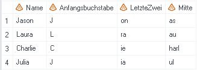

Nützlicher Code
===============

* * *

Auch beim Arbeiten mit Abfragen und Anwendungsroutinen des SAS Enterprise Guide kommt man teilweise nicht ganz um die Verwendung von Code bzw. Funktionen herum. Oft ist es die einzige oder zumindest die beste Möglichkeit, auf einfache und schnelle Art und Weise neue Variablen zu generieren. Im Folgenden sind einige nützliche Funktionen und Statements zusammengetragen. Sie können in einer Abfrage folgendermassen verwendet werden:

Neue berechnete Spalte hinzufügen  -> Erweiterter Ausdruck

put()
-----

Mit der put()-Funktion lässt sich eine numerische Variable mittels Format in eine Textvariable umwandeln.

> put(Variable, Format.)

Anwendungsbeispiel: Die Personen in einem Datensatz sollen anhand ihres Alters verschiedenen Altersgruppen zugeordnet werden. Anschliessend soll die Anzahl Personen pro Altersgruppe und Geschlecht gezählt werden.

Problem: Es reicht nicht, der Variable _Alter_ in der Abfrage ein Format für die Altersgruppen zuzuweisen. Das Format bzw. die Altersgruppe ist zwar im Vordergrund sichtbar, die Variable enthält aber immer noch das exakte Alter. Wird nun die Anzahl Personen nach Geschlecht und Alter gezählt, resultiert überall eine 1, auch wenn es bspw. drei Frauen in der Altersgruppe «20 bis 60» gäbe.

 

Ein möglicher Lösungsansatz ist es, die numerische Variable _Alter_ in eine Textvariable _Altersgruppe_ umzuwandeln:

`put(t1.Alter, fmt_alter.)`

Anschliessend kann die Anzahl Personen nach der Variable _Geschlecht_ und der neuen Variable _Altersgruppe_ gezählt werden.

Hinweis: Dieses Problem kann auch mittels [CASE Statement](code.html#case-statement) gelöst werden.

substr()
--------

Mit der substr()-Funktion lässt sich ein Teil eines Strings - ein Substring - extrahieren.

> substr(Variable, Startpunkt, Länge)

Anwendungsbeispiel: Vom Vornamen der Personen im Datensatz soll jeweils der Anfangsbuchstabe extrahiert und in einer neuen Variable gespeichert werden. Dieser Substring beginnt beim ersten Buchstaben und ist ein Zeichen lang:

`substr(t1.Name, 1, 1)`

In einer weiteren Variable sollen die zwei letzten Buchstaben des Vornamens gespeichert werden. Dieser Substring beginnt beim zweitletzten Buchstaben und ist zwei Zeichen lang:

`substr(t1.Name, length(t1.Name)-1, 2)`

Schliesslich soll noch der restliche, mittlere Teil des Vornamens in einer separaten Variable gespeichert werden. Dieser Substring beginnt beim zweiten Buchstaben und enthält alle Zeichen ausser das erste und die letzten zwei, umfasst also «Gesamte Anzahl - 3» Zeichen:

`substr(t1.Name, 2, length(t1.Name)-3)`

scan()
------

Mit der scan()-Funktion lässt sich ein Wort aus einer Reihe von Wörtern extrahieren, welche mit bestimmten Trennzeichen abgetrennt sind.

> scan(Variable, ntes Wort \[, Trennzeichen\])

Nach folgenden Trennzeichen wird automatisch gesucht: Leerzeichen ! $ % & ( ) \* + , – . / ; < |

Anwendungsbeispiel: In einem Datensatz ist zu jeder Person der komplette Name erfasst. Nachname und Vorname sind dabei mit Komma abgetrennt.

Nun sollen zwei neue Variablen erstellt werden, welche den Vornamen und den Nachnamen enthalten:

Vorname: `scan(t1.Name, 2)`  
Nachname: `scan(t1.Name, 1)`

Problem: Wenn ein Doppelname enthalten ist, funktioniert dieser Code nicht, da der Bindestrich automatisch als Trennzeichen erkennt wird.

In diesem Fall muss der Funktion explizit die Information mitgegeben werden, welches Trennzeichen verwendet werden soll:

Vorname: `scan(t1.Name, 2, ",")`  
Nachname: `scan(t1.Name, 1, ",")`

CASE Statement
--------------

Mit einem CASE Statement kann eine neue Variable generiert werden, deren Ausprägungen von der erfüllten Bedingung abhängig sind.

> CASE  
>    WHEN Bedingung1 THEN Resultat1  
>    WHEN Bedingung2 THEN Resultat2  
>    WHEN BedingungN THEN ResultatN  
>    ELSE Resultat  
> END

Anwendungsbeispiel: Die Personen in einem Datensatz sollen anhand ihres Alters verschiedenen Altersgruppen zugeordnet werden. Anschliessend soll die Anzahl Personen pro Altersgruppe und Geschlecht gezählt werden.

Dazu wird zuerst mittels CASE-Statement eine neue Variable _Altersgruppe_ generiert:

`CASE WHEN t1.Alter BETWEEN 0 AND 19 THEN "Bis 20 Jahre" WHEN t1.Alter BETWEEN 20 AND 60 THEN "20 bis 60 Jahre" WHEN t1.Alter > 60 THEN "Über 60 Jahre" END`

Anschliessend kann die Anzahl Personen nach der Variable Geschlecht und der neuen Variable Altersgruppe gezählt werden.

Hinweis: Dieses Problem kann auch mittels [put()-Funktion](code.html#put) gelöst werden.

* * *
