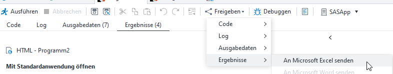
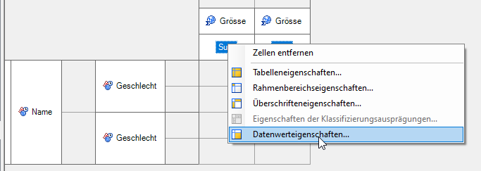

Daten exportieren
=================

* * *

An Microsoft Excel senden
-------------------------

Der Output einer Anwendungsroutine (bspw. Zusammenfassungstabelle) kann folgendermassen in Excel exportiert werden:  

Problem: Ist im Enterprise Guide unter «Extras -> Optionen -> Ergebnisse -> Allgemein» das Ergebnisformat HTML ausgewählt, dann wird der entsprechende Output mit einem Punkt als Dezimaltrennzeichen exportiert. In Excel kann damit dann nicht weitergerechnet werden und im schlimmsten Fall wird die Zahl sogar als Datum erkannt.  

Es gibt mehrere Möglichkeiten, dieses Problem zu umgehen:

*   Als Ergebnisformat «SAS Report» anstatt «HTML» auswählen. Wird der Output eines SAS Reports mittels «An Microsoft Excel senden» exportiert, werden die Dezimaltrennzeichen korrekt angezeigt.
*   Als Ergebnisformat zusätzlich «Excel» auswählen. So wird beim Ausführen der Anwendungsroutine direkt ein Excel-File generiert, das direkt aus SAS mittels Doppelklick geöffnet werden kann.
*   Für die numerische Variable das Format `NUMXw.d` auswählen. Bei einer Zusammenfassungstabelle wird das folgendermassen gemacht: Rechtsklick auf die Statistik (bspw. Sum) -> Datenwerteigenschaften -> Ausgabeformat -> Numerisch -> NUMXw.d. 
*   Zum Exportieren entweder [ODS Excel](https://ksz91.github.io/SAS_User_Guide/export.html#ods-excel) oder Proc Export (Eintrag dazu folgt) verwenden.

ODS Excel
---------

ODS Excel bietet die Möglichkeit, den Output von SAS-Prozeduren (bspw. Proc Report, Proc Tabulate oder Proc Print) direkt in ein Excel-File zu schreiben.

> ods excel file="< Pfad >\\Dateiname.xlsx" \[diverse Optionen\];  
>    \[proc print, proc report, proc tabulate, o.ä.\]  
> ods csv close;

Anwendungsbeispiel 1: Mit ODS Excel lässt sich die Struktur einer Webtabelle nachbilden, sodass der generierte Export nur noch mittels Copy-Paste in die Webtabelle eingefügt werden muss.

`ods excel style=journal 
	file="<Pfad>/SAS-Export T99_9_99.xlsx" 
	options(embedded_titles='yes' sheet_interval='bygroup' sheet_name='#byval1'); 
title "Anzahl Personen nach Altersgruppe"; 
	proc tabulate data=personen; 
		by Jahr; 
		[hier kommt Code] 
	run; 
ods excel close;`

*   `style=journal`: Bestimmt das Design, in dem der Excel-Export daherkommt. Für eine Übersicht über alle ODS-Styles siehe [hier](https://documentation.sas.com/doc/en/pgmsascdc/9.4_3.3/statug/statug_odsgraph_sect054.htm).
*   `embedded_titles='yes'` bzw. `title`: Für die exportierte(n) Tabelle(n) kann ein Titel festgelegt werden. Dasselbe funktioniert auch mit Fussnoten (`embedded_footnotes='yes'` bzw. `footnote`).
*   `sheet_interval='bygroup'`: Für jede Ausprägung der by-Variable wird ein neues Tabellenblatt angelegt, in diesem Beispiel also für jedes Jahr.
*   `sheet_name='#byval1'`: Die Tabellenblätter werden entsprechend der Ausprägungen der by-Variable benannt, in diesem Beispiel also _«2021»_, _«2020»_, _«2019»_, etc.
*   `proc tabulate`: Hier kann bspw. der Code einer Zusammenfassungstabelle eingefügt werden: Doppelklick auf Symbol der Zusammenfassungstabelle -> Code -> Kopieren von «PROC TABULATE» bis «RUN;».

Anwendungsbeispiel 2: Eine leicht modifizierte Form - ODS CSV - findet bei der Produktion von tsv-Files für die interaktiven Indikatoren Anwendung.

`ods csv file = "<Pfad>\9999.tsv" encoding='utf-8' options(delimiter="09"x); 
	proc tabulate data=personen; 
		[hier kommt Code] 
	run; 
ods csv close;`

*   `encoding='utf-8'`: Sorgt u. a. dafür, dass die Umlaute richtig dargestellt werden.
*   `delimiter="09"x`: Erzeugt ein Tabulator-getrenntes Dokument.
*   `proc tabulate`: Hier kann bspw. der Code einer Zusammenfassungstabelle eingefügt werden: Doppelklick auf Symbol der Zusammenfassungstabelle -> Code -> Kopieren von «PROC TABULATE» bis «RUN;».

Es gibt zahlreiche weitere Möglichkeiten, den Output von ODS Excel zu steuern bzw. anzupassen. Für eine vollständige Übersicht siehe [hier](https://documentation.sas.com/doc/en/pgmsascdc/9.4_3.5/odsug/p09n5pw9ol0897n1qe04zeur27rv.htm).

Weitere Informationen zu ODS Excel finden sich auch auf der Seite zur [Server-Migration](https://ksz91.github.io/SAS_User_Guide/server.html#export-mit-ods-excel).

Wenn der Export mit ODS Excel sehr lange dauert, ist unter Umständen ein [Export mittels Data Step und PUT-Statement](big.html#export-mittels-data-step) eine Option.

* * *