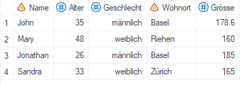
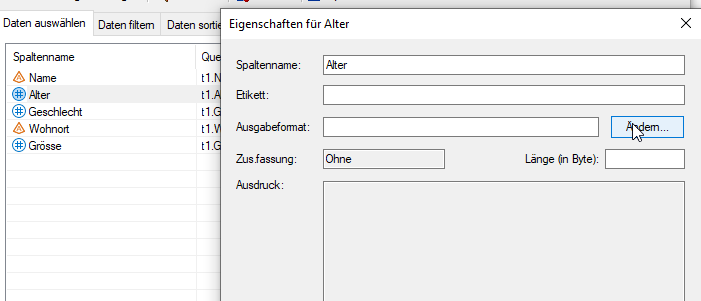
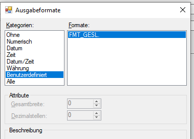
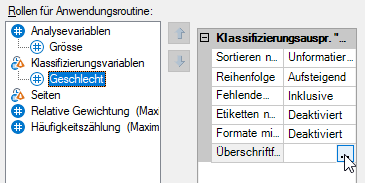
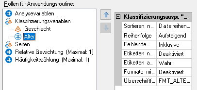
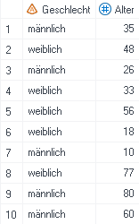
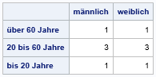
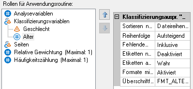
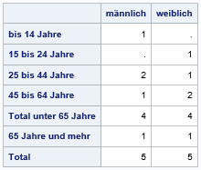

Benutzerdefinierte Formate
==============================

* * *

SAS bietet die Möglichkeit, eigene Formate zu schreiben. Formate werden mittels PROC FORMAT-Statement in folgender Form erstellt:  

> proc format;  
> value < Formatname >  
>    \[...hier wird das Format definiert...\];  
> run;

Bei der Namensgebung gibt es einige Konventionen zu berücksichtigen: 

*   Formatnamen dürfen nicht mit einer Zahl enden.  
*   Bei alphanumerischen Formaten muss der Name mit einem Dollarzeichen ($) beginnen.  
*   Der Formatname darf nich länger als 32 Zeichen sein.  

Hinweis: Innerhalb eines PROC FORMAT können mehrere VALUE-Statements bzw. mehrere Formate definiert werden. 

Numerisch oder alphanumerisch
-------------------

Formate können numerisch oder alphanumerisch sein:

*   Wenn ein Datensatz nur codierte Werte enthält, dann wird ein _numerisches Format_ verwendet, um den Codes eine Bezeichnung zuzuordnen, bspw. bei der Variable Geschlecht den Codes 1 und 2  die Bezeichnungen «männlich» und «weiblich»: 

	`proc format;
	value fmt_gesl
		1="männlich"
		2="weiblich";
	run;`  

	Wird das Format _fmt_gesl_ auf die Variable _Geschlecht_ angewendet ergibt sich folgende Transformation:  
    
	&ensp;&ensp;&ensp;<strong>&rarr;</strong>&ensp;&ensp;
	  

*   Mit einem _alphanumerischen Format_ werden den Ausprägungen einer Textvariable neue Bezeichnungen zugewiesen, bspw. dem Wohnort der entsprechende Kanton: 

	`proc format;
	value $fmt_wohnort
		"Basel","Riehen"="Basel-Stadt"
		"Zürich"="Zürich";
	run;`  

	Wird das Format _$fmt_wohnort_ auf die Variable _Wohnort_ angewendet ergibt sich folgende Transformation:  
    
	&ensp;&ensp;&ensp;<strong>&rarr;</strong>&ensp;&ensp;
	

Anwenden von benutzerdefinierten Formaten
-------------------

Es gibt verschiedene Möglichkeiten, die erzeugten Formate einer Variable zuzuweisen:  

*   Abfrage erstellen: Doppelklick auf die entsprechende Variable -> Ändern ->  Benutzerdefiniert 
	
	  
*   Zusammenfassungstabelle: Ensprechende Variable anwählen -> Überschriftformat -> Benutzerdefiniert
	
	
*   Programmcode: Formate können direkt in Prozeduren (PROC TABULATE, PROC PRINT, PROC REPORT)...

	`proc tabulate data=work.person;
		var groesse;
		class geschlecht /	order=unformatted missing;
		format Geschlecht fmt_gesl. Wohnort $fmt_wohnort.;
		table geschlecht, groesse*mean;
	run;`

	...oder auch in einem DATA STEP verwendet werden.

	`data person_fmt;
	set person;
	format Geschlecht fmt_gesl. Wohnort $fmt_wohnort.;
	run;`

Hinweis: Um das Format im Code zu referenzieren wird der Formatname gefolgt von einem Punkt verwendet.

Gruppieren mittels Format
-------------------

Mit Formaten kann nicht nur einzelnen Werten eine Bezeichnung zugeordnet werden, es können auch mehrere Werte zu einer Gruppe zusammengefasst werden.  

Anwendungsbeispiel: Anhand der Variable Alter sollen Altersgruppen gebildet werden.

`proc format;
value fmt_alter
	0-19 = "bis 20 Jahre"  
	20-60 = "20 bis 60 Jahre"  
	61-high = "über 60 Jahre";
run;`

Wichtig: Für gewisse Anwendungen (bspw. Summieren nach Altersgruppe in einer Abfrage) reicht es nicht, der numerischen Variable einfach das Format _fmt_alter_ zuzuweisen, sondern es muss eine neue Variable _Altersgruppe_ generiert werden. Mehr dazu [hier](code.html#put).

Sortieren mittels Format
-------------------

Beim Arbeiten mit Formaten und Auswertungen mittels Zusammenfassungstabelle ist manchmal eine bestimmte Reihenfolge erforderlich, bspw. weil diese für einen tsv-Export benötigt wird. Mit der Option `notsorted` kann die Reihenfolge aus dem PROC FORMAT-Statement erzwungen werden.

`proc format;
value fmt_alter (notsorted)
	61-high = "über 60 Jahre"
	20-60 = "20 bis 60 Jahre" 
	0-19 = "bis 20 Jahre";
run;`

Damit es mit der Reihenfolge klappt, sind in der Zusammenfassungstabelle einige Einstellungen nötig:  

*   `Sortieren nach`: Hier `Dateireihenfolge` auswählen.  
*   `Ettiketten aus Format vorab übernehmen`: Auf `Wahr` setzen, damit das Format vor dem Ausführen der Zusammenfassungstabelle geladen wird.  
*   `Überschriftformat`: Hier das entsprechende benutzerdefinierte Format auswählen, in diesem Beispiel `fmt_alter`.  
  

So kann die Anzahl Personen pro Altersgruppe nach Geschlecht bestimmt und das Ergebnis nach absteigender Altersgruppe sortiert werden:  
    
	&ensp;&ensp;&ensp;<strong>&rarr;</strong>&ensp;&ensp;
	  

Totale und Subtotale mittels Format
-------------------

Mit Formaten können auch Totale oder Subtotale gebildet werden. In diesem Fall werden den Werten mehrere Labels zugeordnet, weshalb zusätzlich zur Option `notsorted` auch die Option `multilabel` verwendet werden muss. Bspw. gehören die 13-Jährigen dann zur Gruppe _unter 15 Jahre_ und _Total unter 65 Jahre_.  

`proc format;
value fmt_alter (multilabel notsorted)
    0-14 = "unter 15 Jahre"
	15-24 ="15 bis 24 Jahre" 
    25-44 = "25 bis 44 Jahre"
	45-64 = "45 bis 64 Jahre"  
    0-64 = "Total unter 65 Jahre"
	65-high = "65 Jahre und mehr"
	0-high = "Total";
run;`

Zusätzlich zu den im [vorherigen Abschnitt](formate.html#sortieren-mittels-format) beschriebenen Einstellungen muss Folgendes eingestellt werden:

 *   `Formate mit mehreren Etiketten`: Auf `Aktiviert` setzen.
  
So können das Subtotal für die unter 65-Jährigen und das Total aller Personen hinzugefügt werden:  
    
	&ensp;&ensp;&ensp;<strong>&rarr;</strong>&ensp;&ensp;
	  

* * *