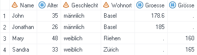
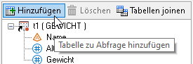

Datensätze verbinden
==============================

* * *

Datensatz anhängen
-------------------

Beispiel: Die Grössenangaben von Frauen und Männern sind in zwei separaten Datensätzen erfasst. Diese beiden Datensätze sollen zu einem Datensatz zusammengefasst werden, der die Daten für beide Geschlechter enthält.  

 

#### Anwendungsroutine _Tabelle anhängen_

Für diesen Lösungsansatz wird einer der beiden Datensätze angewählt (einfacher Mausklick) und unter «Anwendungsroutinen -> Durchsuchen -> Daten» die Anwendungsroutine _Tabelle anhängen_ ausgewählt.  
  
 

Im sich öffnenden Fenster auf _Tabelle hinzufügen_ klicken und den Datensatz auswählen, der angehängt werden soll, in diesem Fall «WEIBLICH».   

	&ensp;&ensp;&ensp;<strong>&rarr;</strong>&ensp;&ensp;
  

Unter _Ergebnisse_ kann ein Name für den neuen Datensatz gewählt werden, in diesem Fall «ALLE_PERSONEN»:  

Dann auf _Ausführen_ klicken um die Tabelle anzuhängen und den neuen Datensatz zu generieren:  

#### DATA STEP  

Die einfachste Möglichkeit, einen Datensatz an einen anderen anzuhängen, ist ein DATA STEP.  
Folgender Code hängt die Datensätze «MAENNLICH» und «WEIBLICH» untereinander und speichert das Ergebnis in einem neuen Datensatz «ALLE_PERSONEN»:

`data alle_personen;
set maennlich weiblich;
run;`

#### PROC APPEND  

Eine weitere Möglichkeit, mittels Programmieren einen Datensatz an einen anderen anzuhängen, ist ein PROC  APPEND-Statement. Folgender Code hängt an den Datensatz «MAENNLICH» den Datensatz «WEIBLICH» an und überschreibt mit dem Ergebnis den urpsprünglichen Datensatz «MAENNLICH».

`proc append
    base=maennlich
    data=weiblich;
run;`

#### Unterschiede zwischen den Lösungsansätzen

Die verschiedenen Lösungsansätze unterscheiden sich teilweise voneinander. Sehen wir uns an, was passiert, wenn die Variablennamen in den beiden Datensätzen nicht identisch geschrieben sind (bspw. Groesse und Grösse): 

*   Sowohl die Anwendungsroutine _Tabelle anhängen_ als auch der _DATA STEP_ führen zu folgendem Ergebnis:  

*   Beim _PROC APPEND_-Statement hingegen werden die Datensätze nicht verbunden und es resultiert stattdessen eine Fehlermeldung:  

Soll der Append trotzdem durchgeführt werden, kann dies mit der Option _force_ erreicht werden:

    `proc append
        base=maennlich
        data=weiblich
        force;
    run;`

    So werden die Datensätze trotzdem aneinandergehängt. Allerdings werden nur Werte vom Datensatz «WEIBLICH» angehängt, wenn die Variablennamen auch im Datensatz «MAENNLICH» vorkommen:
    
    
Join mittels Abfrage
-------------------
Beispiel: Das Gewicht und die Grösse der Zielpersonen ist in zwei separaten Datensätzen erfasst. Nun soll ein neuer Datensatz erstellt werden, der beide Angaben enthält.

Dazu wird mittels rechtem Mausklick auf einen der beiden Datensätze und _Abfrage erstellen_ eine Abfrage erstellt. Mit _Hinzufügen_ wird der zweite Datensatz ergänzt. Nun können die gewünschten Variablen gewählt werden bzw. ins Fenster _Daten auswählen_ gezogen werden. Hier die Variablen _Name_ und _Alter_ nur einmal auswählen (bspw. aus dem Datensatz t1).

Danach muss unter _Tabellen joinen_ definiert werden, anhand welcher Variablen der Join durchgeführt werden und um welche Art von Join (Inner Join, Left Join, Right Join etc.) es sich handeln soll. 

Es wird automatisch ein Join über die Variable _Name_ vorgeschlagen. Da der Name «Sandra» zweimal vorkommt, wäre ein Join anhand des Namens nicht eindeutig. Deshalb wird der Join zusätzlich über die Variable _Alter_ ausgeführt. Dazu auf die Variable _Alter_ im linken Kästchen klicken (und halten) und den Cursor rüber zur Variable _Alter_ im rechten Kästchen ziehen und loslassen.  

Die Art des Joins spielt in diesem Beispiel keine Rolle, da in beiden Datensätze die gleichen Zielpersonen drin sind und es keine fehlenden Einträge gibt. Im nächsten Abschnitt wird näher auf den Unterschied zwischen den verschiedenen Join-Typen eingegangen.  

Es resultiert folgender Datensatz:  

Verschiedene Join-Typen
-------------------
#### Inner Join  
Der neu erzeugte Datensatz enthält nur die Beobachtungen, welche in beiden Datensätzen vorkommen.

  
&ensp;&ensp;&ensp;&ensp;&ensp;&ensp;&ensp;&ensp;&ensp;&ensp;&ensp;&ensp;&ensp;&ensp;&ensp;&ensp;&ensp;&ensp;&ensp;&ensp;&ensp;<strong>&darr;</strong>  
  

#### Left Join  
Der neu erzeugte Datensatz enthält nur die Beobachtungen, welche im ersten Datensatz vorkommen. Diejenigen Beobachtungen, welche im zweiten Datensatz nicht vorkommen, weisen für die Variable _Grösse_ einen fehlenden Wert auf.  

  
&ensp;&ensp;&ensp;&ensp;&ensp;&ensp;&ensp;&ensp;&ensp;&ensp;&ensp;&ensp;&ensp;&ensp;&ensp;&ensp;&ensp;&ensp;&ensp;&ensp;&ensp;<strong>&darr;</strong>  
  

#### Right Join
Der neu erzeugte Datensatz enthält nur die Beobachtungen, welche im zweiten Datensatz vorkommen. Diejenigen Beobachtungen, welche im ersten Datensatz nicht vorkommen, weisen für die Variable _Gewicht_ einen fehlenden Wert auf.    

  
&ensp;&ensp;&ensp;&ensp;&ensp;&ensp;&ensp;&ensp;&ensp;&ensp;&ensp;&ensp;&ensp;&ensp;&ensp;&ensp;&ensp;&ensp;&ensp;&ensp;&ensp;<strong>&darr;</strong>  
 

#### Full Outer Join 
Der neu erzeugte Datensatz enthält alle Beobachtungen, die in einem der beiden Datensätze vorkommen. 

  
&ensp;&ensp;&ensp;&ensp;&ensp;&ensp;&ensp;&ensp;&ensp;&ensp;&ensp;&ensp;&ensp;&ensp;&ensp;&ensp;&ensp;&ensp;&ensp;&ensp;&ensp;<strong>&darr;</strong>  

Hinweis: Bei den anderen Join-Arten reicht es, die Variablen Name und Alter aus einem der beiden Datensätze t1 oder t2 auszuwählen. Beim Full Outer Join funktioniert das nicht. Werden die Variablen aus t1 genommen, dann resultieren fehlende Werte bei derjenigen Beobachtung, die nur in t2 vorkommt und umgekehrt. Um sicherzugehen, dass die Variablen Name und Alter keine fehlenden Werte aufweisen, braucht es einen kleinen Umweg über die COALESCE-Funktion bzw. «Neue berechnete Spalte hinzufügen -> Erweiterter Ausdruck»:

Merge
-------------------

Eine Alternative zum Join mittels Abfrage ist ein MERGE-Statement in einem DATA STEP. Dazu müssen zuerst die beiden zu verbindenden Datensätze nach den by-Variablen sortiert werden.

#### Syntax
> proc sort data = dataset1;  
> by var1 var2;  
> run;  

> proc sort data = dataset2;  
> by var1 var2;  
> run;  

> data new_dataset;  
> merge dataset1 dataset2;  
> by var1 var2;  
> run; 

Ohne weitere Spezifikation führt diese Syntax zu einem Full Outer Join (siehe Abschnitt [Verschiedene Join-Typen](merge.html#verschiedene-join-typen)). Um den MERGE einzuschränken (bspw. auf einen Inner Join), braucht es ein IN-Statement.

#### IN-Statement

Mit dem IN-Statement wird jedem Datensatz eine Art ID zugewiesen, die dann in einem IF-Statement verwendet werden kann. 

Beispiel: Um den Inner Join aus dem Abschnitt [Verschiedene Join-Typen](merge.html#verschiedene-join-typen) zu replizieren, wird dem Datensatz _gewicht_ die ID «in1» und dem Datensatz _groesse_ die ID «in2» zugewiesen. Das IF-Statement `if in1 and in2;` wählt alle Beobachtungen aus, welche sowohl im Datensatz _gewicht_ als auch im Datensatz _groesse_ vorkommen.

Inner Join:  
`data gewicht_groesse;
merge gewicht (in=in1) groesse (in=in2);
by name alter;
if in1 and in2;
run;`  

Nach dem gleichen Prinzip können auch der Left Join und der Right Join repliziert werden. Für den Left Join braucht es das IF-Statement `if in1;`. Damit werden nur die Beobachtungen ausgewählt, welche im Datensatz _gewicht_ vorkommen. Für den Right Join braucht es das IF-Statement `if in2;`. Dieses wählt nur diejenigen Beobachtungen aus, welche im Datensatz _groesse_ vorkommen.

Left Join:  
`data gewicht_groesse;
merge gewicht (in=in1) groesse (in=in2);
by name alter;
if in1;
run;` 

Right Join:  
`data gewicht_groesse;
merge gewicht (in=in1) groesse (in=in2);
by name alter;
if in2;
run;`

Der Full Outer Join kann entweder mit dem IF-Statement `if in1 or in2;` repliziert werden oder indem das IF-Statement einfach weggelassen wird.  

Full Outer Join:  
`data gewicht_groesse;
merge gewicht (in=in1) groesse (in=in2);
by name alter;
if in1 or in2;
run;` 

* * *