SAS Enterprise Guide 8.3
========================

* * *

Anwendungsroutinen
------------------

Die Anwendungsroutinen können unter «Datei -> Anwendungsroutinen öffnen -> Durchsuchen» oder auch über das entsprechende Symbol weiter rechts in der Menüleiste aufgerufen werden.  
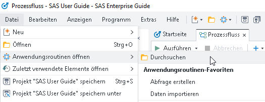  
Eine der am häufigsten verwendeten Anwendungsroutinen - die Zusammenfassungstabelle - ist bspw. dem Stichwort «Beschreiben» zugeordnet. Mit Mausklick auf den Stern können Anwendungsroutinen als Favorit gespeichert werden.  
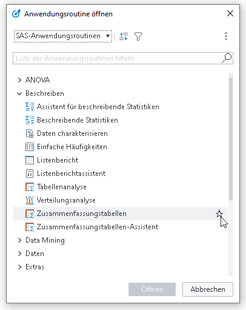  
Ist ein Datensatz geöffnet, so können die Anwendungsroutinen direkt über den Reiter oberhalb des Datensatzes aufgerufen werden. Dort befinden sich auch die gespeicherten Favoriten sowie eine Auflistung der zuletzt verwendeten Anwendungsroutinen.  
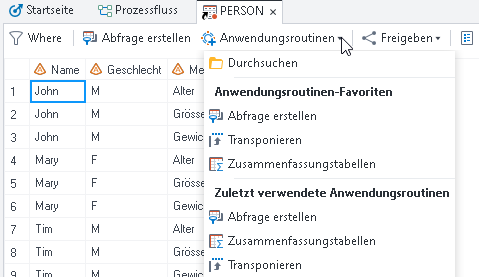

Backup-Intervall
----------------

Standardmässig wird alle fünf Minuten ein Backup für die Automatische Wiederherstellung erstellt. Das dauert jedes Mal ein paar Sekunden und unterbricht somit den Arbeitsfluss erheblich. Unter «Extras -> Optionen -> Automatische Wiederherstellung» kann das Backup-Intervall angepasst werden. 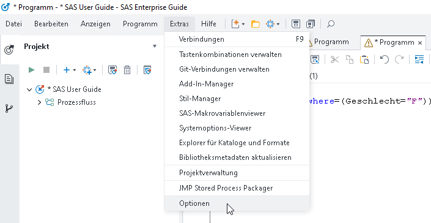  
Ein automatisches Backup ist grundsätzlich sinnvoll, weshalb empfohlen wird, diese Funktionalität beizubehalten. Bei Bedarf kann das Intervall aber angepasst werden. 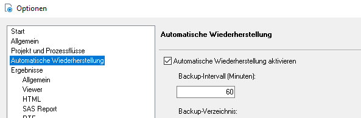

Zurück zum Prozessfluss
-----------------------

Wenn im alten Enterprise Guide bspw. ein Datensatz geöffnet war, konnte über das Kreuz oben rechts in der Ecke wieder zum Prozessfluss zurückgekehrt werden. Im neuen Enterprise Guide gibt es dafür mehrere Möglichkeiten:  
(1) Den gewünschten Prozessfluss über die Leiste oben anwählen, (2) den Reiter des geöffneten Datensatzes schliessen oder (3) über den Pfeil in der rechten oberen Ecke den gewünschten Prozessfluss auswählen. Das gleiche gilt für das Navigieren hin zu einem Programm oder Datensatz. 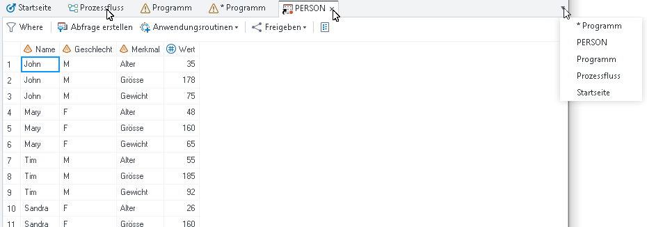 Natürlich kann auch weiterhin wie bisher über die Projektübersicht auf der linken Seite mit Doppelklick ein Prozessfluss, Programm oder Datensatz angewählt werden. 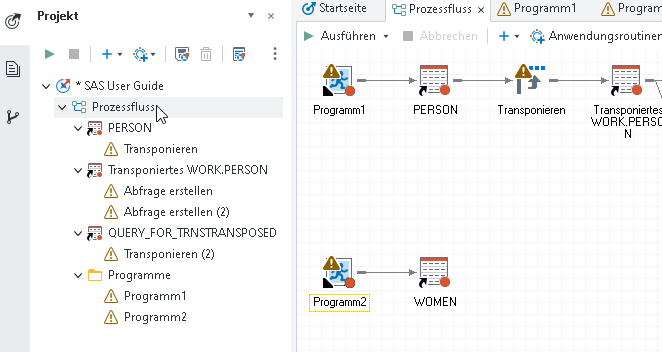

Teilung der Programm-Reiter
---------------------------

Beim Ausführen von Programmen resultiert standardmässig eine vertikale Teilung in ein Fenster «Code» und ein Fenster mit den Reitern «Log» und «Ausgabedaten». 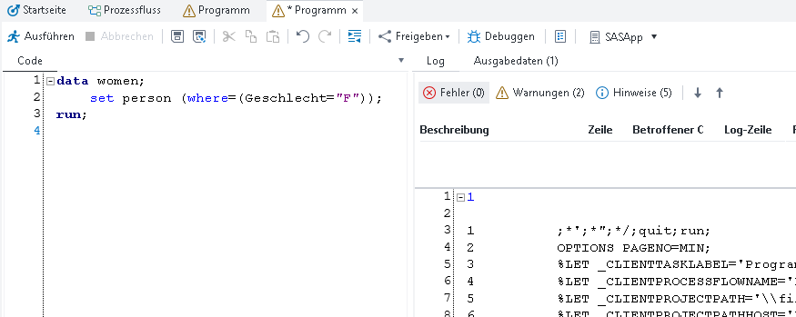  
Wem das zu unübersichtlich ist, kann unter «Anzeigen -> Voreinstellungen für Programm-Reiter» die Einstellung «Standard» auswählen.  
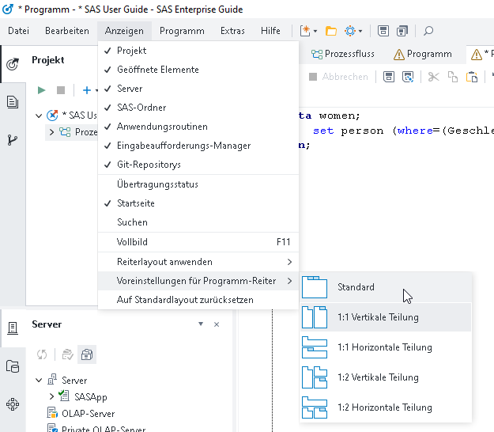  
So wird immer nur ein Programm-Reiter angezeigt und in der Leiste oben kann zwischen den Reitern «Code», «Log» und «Ausgabedaten» gewechselt werden. 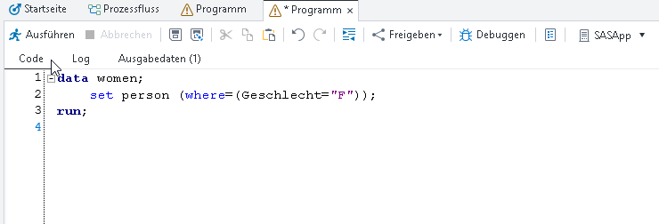

ERROR: You cannot open...
-------------------------

Ist ein Datensatz oben in der Leiste geöffnet, kann er nicht überschrieben werden. Das Ausführen eines entsprechenden Programms führt dann zur Fehlermeldung «ERROR: You cannot open WORK.WOMEN.DATA for output access with member-level control because WORK.WOMEN.DATA is in use by you in resource environment IOM ROOT COMP ENV.» Um diesen Fehler zu beheben, müssen also vor dem Ausführen des Programms lediglich alle im Programm referenzierten Datensätze in der Leiste oben geschlossen werden.  
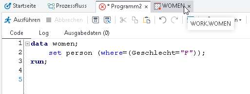  
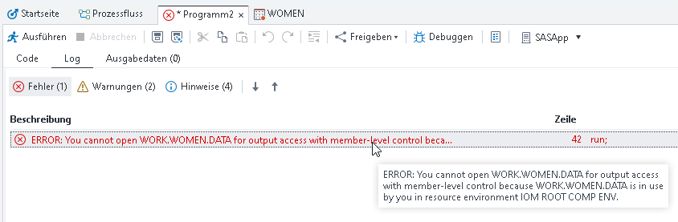

* * *

  