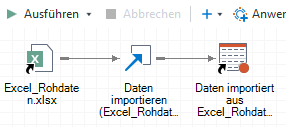
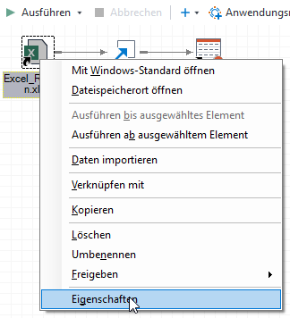
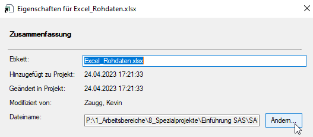

Neue Rohdatenablage
===================

* * *

Der Transfer der Rohdaten vom Datenpool auf die neue Rohdatenablage bringt einen Anpassungsbedarf bei denjenigen SAS-Projekten mit sich, bei welchen Daten direkt vom Datenpool eingelesen werden.

Einlesen mit PROC IMPORT
------------------------

Geschieht das Einlesen über PROC IMPORT, dann reicht es aus, den Pfad unter DATAFILE anzupassen.

Bisher:  
`PROC IMPORT 
	DATAFILE="\\bs.ch\dfs\bs\pd\pd-stata\data\2_Datenpool\..." 
	OUT=Import_Sheet1 
	DBMS=xlsx 
	REPLACE; 
	SHEET="Sheet1"; 
	GETNAMES=YES; 
RUN;`

Neu:  
`PROC IMPORT 
	DATAFILE="\\pdstatasvdata01\datenablage\..." 
	OUT=Import_Sheet1 
	DBMS=xlsx 
	REPLACE; 
	SHEET="Sheet1"; 
	GETNAMES=YES; 
RUN;`

Anwendungsroutine «Daten importieren»
-------------------------------------

Werden die Daten mit der Anwendungsroutine «Daten importieren» eingelesen, dann sieht der Prozessfluss folgendermassen aus:  
  
In diesem Fall sind folgende zwei Schritte nötig:

1.  Rechter Mausklick auf das Excel-Symbol -> Eigenschaften  
    
    
2.  Die Datei über den Ändern-Button am neuen Ablageort suchen 
    

* * *
