Tabellen und Reports
==============================

* * *

Zusammenfassungstabelle
-------------------
Mit der Anwendungsroutine _Zusammenfassungstabelle_ lassen sich Kreuztabellen erstellen. 

Beispiel: Ein Datensatz enthält die Anzahl Personen nach Geschlecht, Herkunft und Altersgruppe.
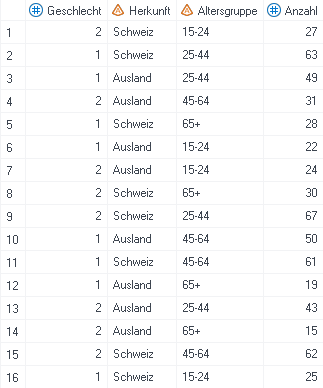  

#### Zusammenfassungstabellen erstellen  
Bei der ersten Anwendung muss die Anwendungsroutine _Zusammenfassungstabelle_ zuerst gesucht werden (siehe [Anleitung](http://127.0.0.1:8000/neweg.html#anwendungsroutinen)). Wurde sie schon verwendet oder sogar in den Favoriten gespeichert, dann ist sie direkt über die Leiste «Anwendungsroutinen» abrufbar.  
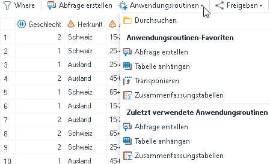

Als erstes werden die Variablen im Menüpunkt «Daten» den entsprechenden Rollen zugeordnet.

*   `Analysevariablen:` Diese Variablen werden analysiert, bspw. gezählt, aufsummiert oder gemittelt. In diesem Beispiel wird die Variable _Anzahl_ aufsummiert.
*   `Klassifizierungsvariablen:` Nach diesen Variablen wird die Analysevariable ausgewertet. In diesem Beispiel wird die Summe der Variable _Anzahl_ nach den Variablen _Geschlecht_ und _Altersgruppe_ gebildet.
*   `Seiten:` Pro Ausprägung dieser Variable wird eine Kreuztabelle generiert. Diese Variable wird automatisch auch unter Klassifizierungsvariablen gelistet. In diesem Beispiel wird pro Ausprägung der Variable _Herkunft_ eine Tabelle erstellt.  

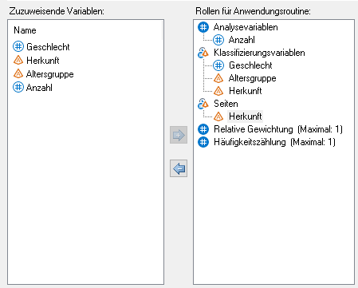  

Danach wird im Menüpunkt «Zusammenfassungstabellen» die Struktur der Kreuztabelle mittels Drag and Drop festgelegt.  
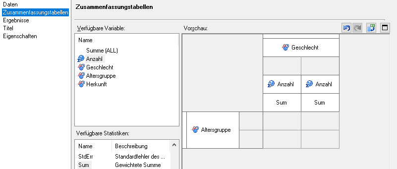  

Im Menüpunkt «Ergebnisse» kann ein Häkchen gesetzt werden, wenn die Ergebnisse der Zusammenfassungstabelle auch in einem SAS-Datensatz gespeichert werden soll.  

Im Menüpunkt «Titel» können ein Titel (bspw. Anzahl Personen nach Geschlecht, Altersgruppe und Herkunft) und eine Fussnote (in diesem Beispiel wird die Default-Fussnote verwendet) für die Tabelle definiert werden.

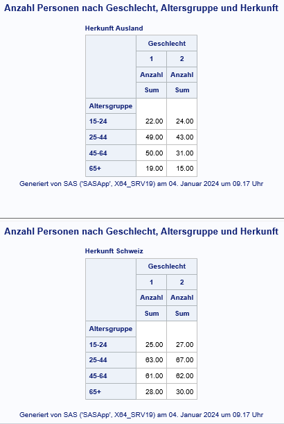  

#### Zusammenfassungstabellen optimieren  
Diese Tabellen können nun noch verschönert werden. Bspw. stören die Etiketten «Geschlecht», «Altersgruppen» und «Anzahl» sowie das Keyword _Sum_. Zudem wäre es schöner, wenn die Spalten zum Geschlecht beschriftet wären, anstatt nur den numerischen Wert der Variable zu enthalten. Die zwei Nachkommastellen sind zudem nicht sinnvoll, da es sich um die Anzahl Personen handelt.

*   Etiketten entfernen:  
    Rechtsklick auf die jeweilige Überschrift -> Überschrifteneigenschaften -> Text bei _Etikett:_ löschen  
    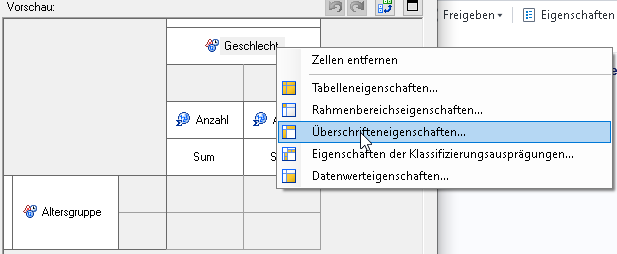 
    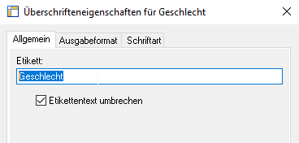  
    Die resultierende Kreuztabelle enthält keine Etiketten mehr und ist nun deutlich übersichtlicher. Der Einfachheit halber wird im Folgenden nur noch die Tabelle mit Herkunft «Ausland» gezeigt.  
    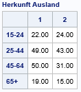  
*   Box beschriften:  
    Die leere Zelle oben links (Box) lässt sich ebenfalls beschriften.  
    Rechtsklick auf den grauen Bereich der Tabelle -> Rahmenbereichseigenschaften -> Etikett -> Folgenden Text verwenden  
      
    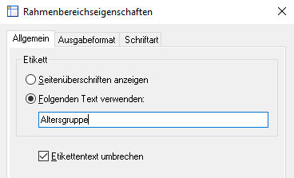  
    Die resultierende Tabelle sieht folgendermassen aus:  
    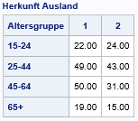  
*   Formate anwenden:  
    Die entsprechende Klassifizierungsvariable anwählen und rechts unter _Überschriftformat_ das [benutzerdefinierte Format](formate.html) auswählen.  
    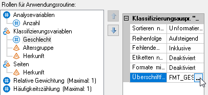  
    Die resultierende Tabelle sieht folgendermassen aus:  
    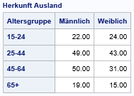  
    Benutzerdefinierte Formate können auch verwendet werden, um in Zusammenfassungstabellen zu gruppieren ([Anleitung](formate.html#gruppieren-mittels-format)), zu sortieren ([Anleitung](formate.html#sortieren-mittels-format)) oder Totale bzw. Subtotale zu bilden ([Anleitung](formate.html#totale-und-subtotale-mittels-format)).  

*   Anzahl Nachkommastellen definieren:  
    Rechtsklick auf _Sum_ -> Datenwerteigenschaften -> Ausgabeformat -> bspw. BEST12.0  
    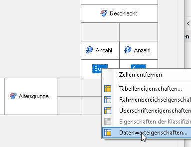  
    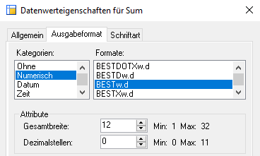  
    Die resultierende Tabelle sieht folgendermassen aus:  
    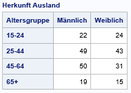   

#### Export von Zusammenfassungstabellen  
Beim Ausführen einer Zusammenfassungstabelle wird PROC TABULATE-Code generiert. Dieser kann nach Doppelklick auf die Zusammenfassungstabelle über den Reiter _Code_ abgefragt werden.  
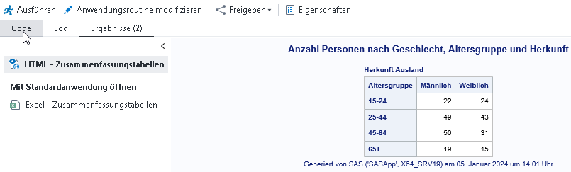  
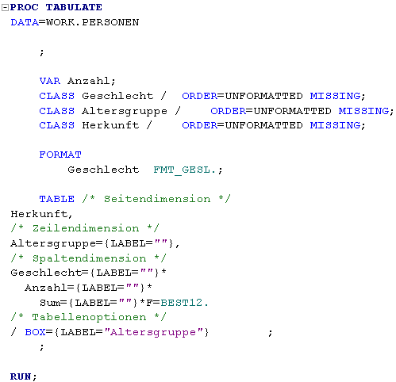  
Dieser Code kann nun kopiert werden (von PROC TABULATE bis RUN;) und bspw. mittels ODS Excel in ein Excel-File exportiert werden. Wie das funktioniert ist [hier](export.html#ods-excel) beschrieben.  

PROC PRINT
-------------------

PROC Print ist die einfachste SAS-Prozedur zum Ausgeben von Datensätzen.  

Beispiel: Ein Datensatz enthält die Anzahl Personen nach Altersgruppe und Geschlecht.  
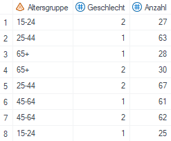  

Ohne weitere Spezifikation gibt PROC PRINT den Datensatz einfach so aus, wie er ist.  

`proc print data=work.person;
run;`  

Der resultierende HTML-Output sieht folgendermassen aus:  
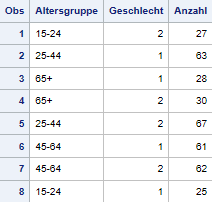  

#### Optionen/Argumente  

*   `NOOBS:` PROC Print ergänzt automatisch eine Spalte, in der die Beobachtungen nummeriert werden. Diese kann mit der Option NOOBS unterdrückt werden.

    `proc print data=work.person noobs;
run;`  
    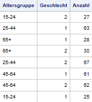   
    Diese Form ist bspw. für das Erstellen von tsv-Dateien für Indikatoren hilfreich. Der PROC PRINT-Output kann dann mittels [ODS EXCEL](export.html#ods-excel) exportiert werden.  

*   `LABEL:` PROC PRINT verwendet standardmässig die Variablennamen aus dem Datensatz. Es können aber auch alternative Spaltenbezeichnungen definiert werden.  

    `proc print data=work.person noobs label;
    label Altersgruppe="Alter" Anzahl="Anzahl Personen";
run;`  
    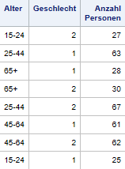   

*   `OBS:` Standardmässig werden alle Beobachtungen des Datensatzes ausgegeben. Mit der Option OBS kann die Anzahl Beobachtungen gewählt werden, die ausgegeben werden soll.  

    `proc print data=work.person (obs=5) noobs;
run;`  
    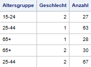  

*   `VAR:` Standardmässig werden alle Variablen des Datensatzes ausgegeben. Mit dem VAR-Statement können Variablen ausgewählt werden.  

    `proc print data=work.person noobs;
    var altersgruppe geschlecht;
run;`  
    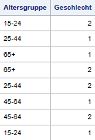  

*   `BY:` Mit dem BY-Statement wird eine separate Tabelle für jede Ausprägung der BY-Variable produziert (Wichtig: Der Datensatz muss nach der BY-Variable sortiert sein).  

    `proc print data=work.person noobs;
    by geschlecht;
run;`  
    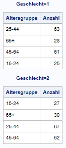    
