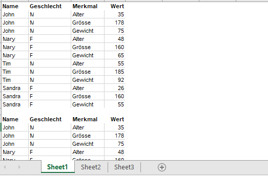
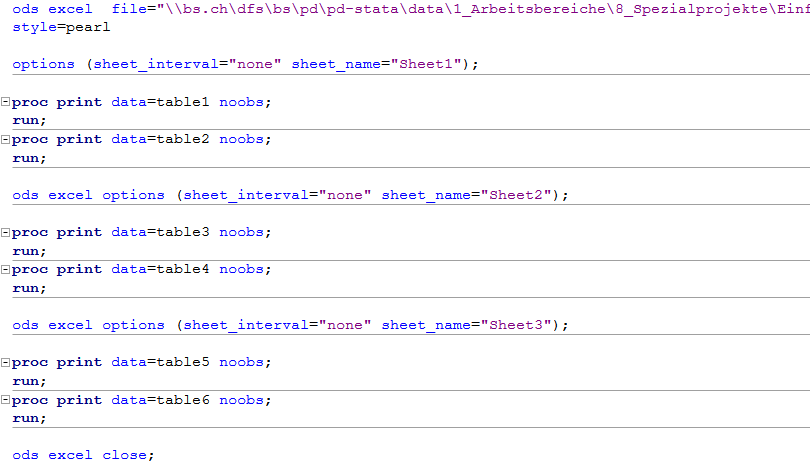
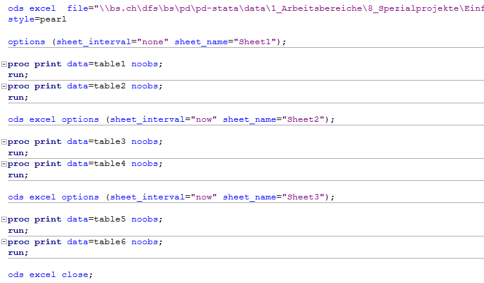

Server-Migration
================

* * *

Die Server-Migration hat teilweise Auswirkungen auf bestehende SAS-Projekte. In ein paar wenigen Fällen funktioniert bestehender Code nicht mehr oder wirkt sich anders aus als bisher. Dies betrifft vor allem den Import und Export von Daten.

Libname Statements
------------------

Libname Statements, die explizit den alten Servernamen verwenden, müssen angepasst werden:

Bisher:  
`libname name '\\pdprodsv09\data\DWH_Name' access=readonly;`

Neu:  
`libname name '\\pdstatasvpsas05\data\DWH_Name' access=readonly;`

Überall wo die Libname Statements via «filedsn» definiert sind, muss nichts angepasst werden:  
`libname name odbc noprompt='filedsn=\\bs.ch\dfs\BS\PD\PD-StatA\Programs\DSN\prod\PXY.Z.DWH_Name.dsn;' schema=xyz access=readonly;`

Export mit ODS Excel
--------------------

Ziel: Ein Excel-File mit je zwei Tabellen pro Tabellenblatt generieren:  
  
Bisher konnte das mit folgendem Code erreicht werden:  
  
Ein neuer Eintrag bei `sheet_name` im options-Statement erzeugte ein neues Tabellenblatt in Excel. Die Option `sheet_interval="none"` verhinderte, dass für jedes Proc Print-Statement ein neues Sheet generiert wird.

Das funktioniert nun nicht mehr so. Ein neuer Eintrag bei `sheet_name` generiert nicht mehr automatisch ein neues Tabellenblatt. Oben gezeigter Code generiert nun ein Excel-File mit nur einem Tabellenblatt «Sheet1», in dem der Output aller Proc Print-Statements untereinander geschrieben wird.

Neu ist folgender Code nötig:  
  
Immer wenn ein neues Tabellenblatt erzeugt werden soll, ist die Option `sheet_interval="now"` nötig.

* * *