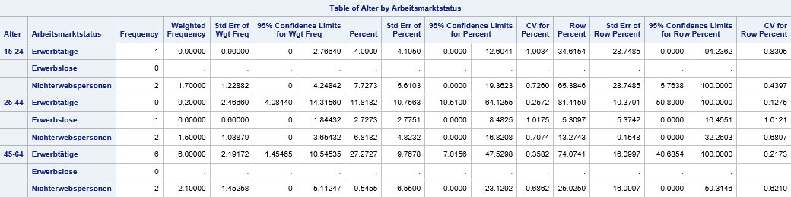

Stichprobenanalyse
==============================

* * *

SAS bietet diverse Möglichkeiten zur Analyse von Stichprobendaten. Im Folgenden wird eine kurze Einführung in die beiden wichtigsten Prozeduren PROC SURVEYFREQ und PROC SURVEYMEANS gegeben. Die Optionen für diese beiden Prozeduren sind sehr vielfältig und hier im SAS User Guide längst nicht alle abgedeckt. Zudem gibt es weitere Prozeduren für die Stichprobenanalyse. Die [SAS-Dokumentation](https://documentation.sas.com/doc/en/pgmsascdc/9.4_3.4/statug/titlepage.htm) liefert weiterführende Informationen zu diesem Thema.

PROC SURVEYFREQ
-------------------
PROC SURVEYFREQ wird verwendet, um aus Stichprobendaten Häufigkeits- und Kreuztabellen zu produzieren. Die Ergebnisse beinhalten Populationstotale und Populationsanteile. Ausserdem können die dazugehörigen Standardfehler, Konfidenzintervalle und Variationskoeffizienten ausgegeben werden.

> proc surveyfreq data=survey_data total=plan_data;  
> strata schichtungsvariable;  
> weight gewichtungsvariable;  
> table var1*var2;  
> ods output crosstabs = output_name;  
> run;  

#### Beispiel    

Ein Datensatz enthält Angaben zum Alter und Arbeitsmarktstatus der Zielpersonen. Es handelt sich um Befragungsdaten, weshalb jeder Zielperson auch ein Gewicht zugeordnet ist.  

Hinweis: Der Datensatz wäre viel zu klein, um zuverlässige Schätzungen bzw. Hochrechnungen zu machen. Es handelt sich um ein rein fiktives Beispiel zur Veranschaulichung der Prozedur.

#### Einwegtabelle  

Mit einem PROC SURVEYFREQ lassen sich die gewichteten Häufigkeiten und Anteile nach Arbeitsmarktstatus berechnen.

`proc surveyfreq data=am_status total=plan;  
format Arbeitsmarktstatus fmt_amstatus.;  
weight Gewicht;  
table Arbeitsmarktstatus;  
ods output oneway=amstatus;  
run;`

*   `data`: Der Datensatz mit den Stichprobendaten.
*   `total`: Ein Datensatz, welcher die Populationstotale enthält. Soll bspw. eine Hochrechnung für die gesamte Bevölkerung des Kantons Basel-Stadt gemacht werden, enthält der Datensatz die Anzahl Einwohnerinnen und Einwohner. Die Variable mit dem Total muss _\_TOTAL\__ genannt werden. Dieses Total wird lediglich für die Berechnung der Standardfehler verwendet. Dabei kommt die sogenannte Endlichkeitskorrektur zur Anwendung.
*   `weight`: Die Gewichtungsvariable sorgt für die Repräsentativität der Ergebnisse.
*   `table`: Diese Variable soll ausgewertet werden.
*   `ods output`: Nötig, falls ein SAS-Datensatz generiert werden soll. Bei Einwegtabellen wird das Keyword _oneway_ verwendet, bei Kreuztabellen _crosstabs_.

#### Kreuztabelle 

Mit einem PROC SURVEYFREQ lassen sich auch die gewichteten Häufigkeiten und Anteile nach Arbeitsmarktstatus und Alter berechnen.  

`proc surveyfreq data=am_status total=plan;  
format Alter fmt_alter. Arbeitsmarktstatus fmt_amstatus.;  
weight Gewicht;  
table Alter*Arbeitsmarktstatus;  
ods output crosstabs=alter_amstat;  
run;`  

#### Optionen  

Es gibt nun noch diverse Möglichkeiten, diesen Output zu verbessern bzw. den jeweiligen Bedürfnissen anzupassen:

*   Die Spalte _Percent_ gibt den Anteil der Personen an, auf den die jeweilige Kombination von Alter und Arbeitsmarktstatus zutrifft. Bspw. sind 4,1% aller Personen 15 bis 24-jährige Erwerbstätige. Wahrscheinlich interessiert hier aber mehr, welcher Anteil der 15 bis 24-Jährigen erwerbstätig sind. Dies kann mit der Option __row__ erreicht werden.  

    `proc surveyfreq data=am_status total=plan;  
    format Alter fmt_alter. Arbeitsmarktstatus fmt_amstatus.;  
    weight Gewicht;  
    table Alter*Arbeitsmarktstatus / row;  
    ods output crosstabs=alter_amstat;  
    run;`  
      
    Nun gibt die Spalte _Row Percent_ an, dass 34,6% der 15 bis 24 Jährigen erwerbstätig sind und 65,4% Nichterwerbspersonen.

*   Wenn nur die Anteile interessieren und nicht die Totale, dann können die Totale mit der Option __nototal__ ausgeblendet werden. 

    `proc surveyfreq data=am_status total=plan;  
    format Alter fmt_alter. Arbeitsmarktstatus fmt_amstatus.;  
    weight Gewicht;  
    table Alter*Arbeitsmarktstatus / row nototal;  
    ods output crosstabs=alter_amstat;  
    run;`  
    

*   Weiter lassen sich Konfidenzintervalle und Variationskoeffizienten berechnen. Die Optionen __cl__ bzw. __clwt__ fügen die Konfidenzinvervalle für die gewichteten Anteile bzw. Häufigkeiten hinzu. Die Option __cv__ ergänzt die Auswertung um die Variationskoeffizienten.    

    `proc surveyfreq data=am_status total=plan;  
    format Alter fmt_alter. Arbeitsmarktstatus fmt_amstatus.;  
    weight Gewicht;  
    table Alter*Arbeitsmarktstatus / row nototal cl clwt cv;  
    ods output crosstabs=alter_amstat;  
    run;`  
      
    Hinweis: Die Konfidenzintervalle und Variationskoeffizienten sind sehr gross, weil die Stichprobe viel zu klein für zuverlässige Ergebnisse ist.

*   Wenn nur die gewichteten Häufigkeiten und nicht die Anteile interessieren, kann die Option __nopercent__ verwendet werden.  

    `proc surveyfreq data=am_status total=plan;  
    format Alter fmt_alter. Arbeitsmarktstatus fmt_amstatus.;  
    weight Gewicht;  
    table Alter*Arbeitsmarktstatus / nopercent nototal clwt;  
    ods output crosstabs=alter_amstat;  
    run;`  
      

Weitere nützliche Informationen zu PROC SURVEYFREQ sind in der [SAS-Dokumentation](https://documentation.sas.com/doc/en/pgmsascdc/9.4_3.4/statug/statug_surveyfreq_toc.htm) zu finden.

PROC SURVEYMEANS
-------------------  

PROC SURVEYMEANS funktioniert sehr ähnlich wie PROC SURVEYFREQ. Es ermöglicht die Berechnung diverser Statistiken wie bspw. den Mittelwert oder den Median für Stichprobendaten.  

Wir betrachten wiederum das Beispiel aus dem Abschnitt zu [PROC SURVEYFREQ](stichproben.html#proc-surveyfreq). Ziel ist es, das durchschnittliche Alter nach Arbeitsmarktstatus zu berechnen.

Der dazu benötigte Code unterscheidet sich im Wesentlichen in zwei Punkten von PROC SURVEYFREQ:  

*   Es gibt kein TABLE-Statement sondern stattdessen ein VAR- und ein DOMAIN-Statement. Mit dem VAR-Statement wird definiert, welche Variable analysiert werden soll, d.h. von welcher Variable bspw. der Mittelwert bestimmt werden soll. Mit dem DOMAIN-Statement wird festgelegt, für welche Subpopulationen die Analyse durchgeführt wird, in diesem Fall nach Arbeitsmarktstatus.
*   Beim ODS OUTPUT-Statement wird anstatt _Oneway_ oder _Crosstabs_ das Keyword _Statistics_ verwendet.

`proc surveymeans data=am_status total=plan;
format Arbeitsmarktstatus fmt_amstatus.;
var Alter;
weight Gewicht;
domain Arbeitsmarktstatus;
ods output Statistics=alter;
run;`

#### Weitere Statistiken

Per Default berechnet PROC SURVEYMEANS den Mittelwert. Es gibt aber diverse weitere Statistiken, die berechnet werden können. Die SAS-Dokumentation gibt einen [Überblick](https://documentation.sas.com/doc/en/statcdc/14.2/statug/statug_surveymeans_syntax01.htm#statug.surveymeans.smeanskeys).  

Ausserdem enthält die [SAS-Dokumentation](https://documentation.sas.com/doc/en/pgmsascdc/9.4_3.4/statug/statug_surveymeans_toc.htm) weitere nützliche Informationen zu PROC SURVEYMEANS.
