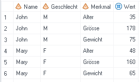
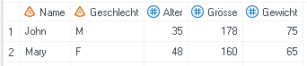
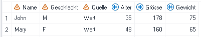
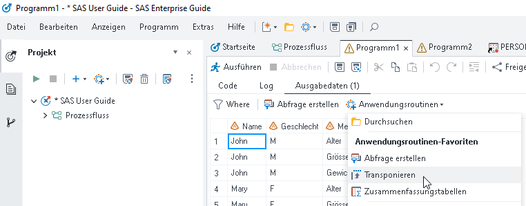
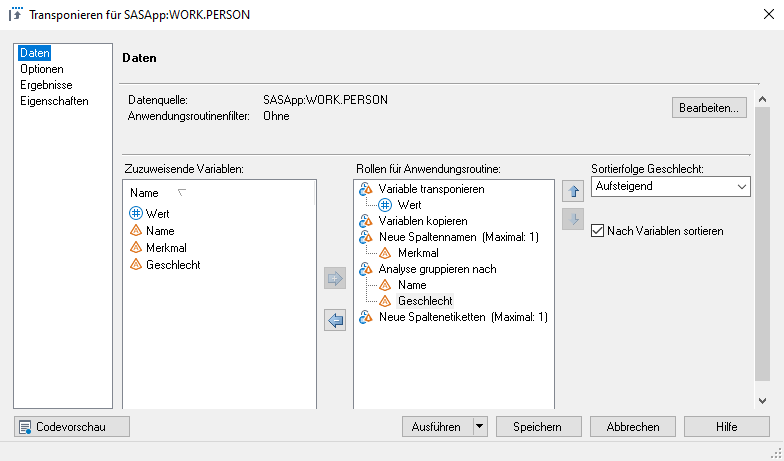
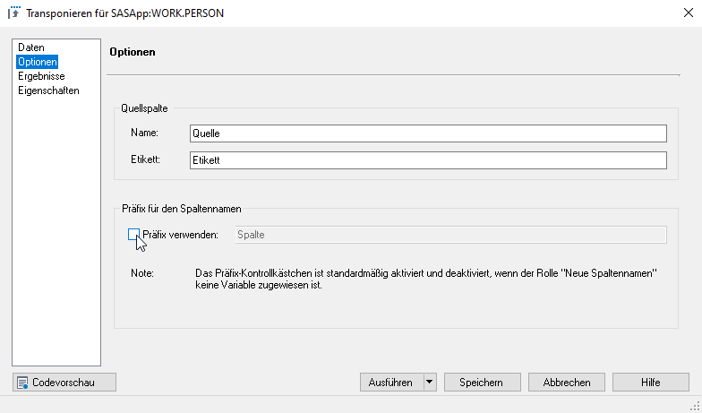
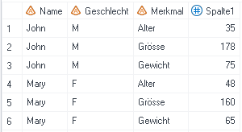
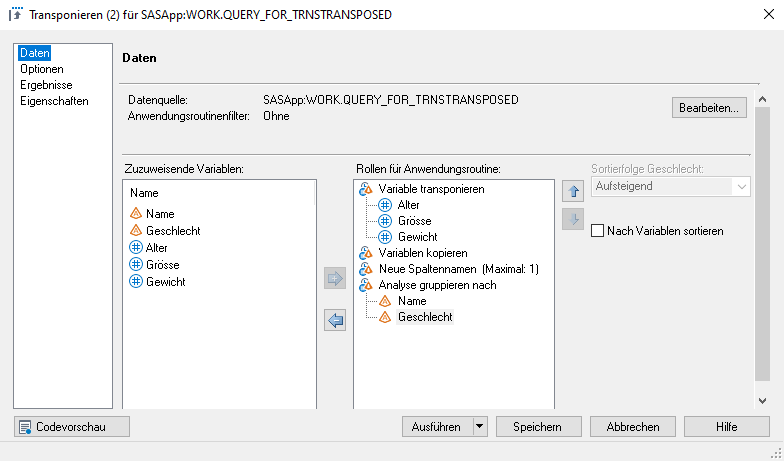
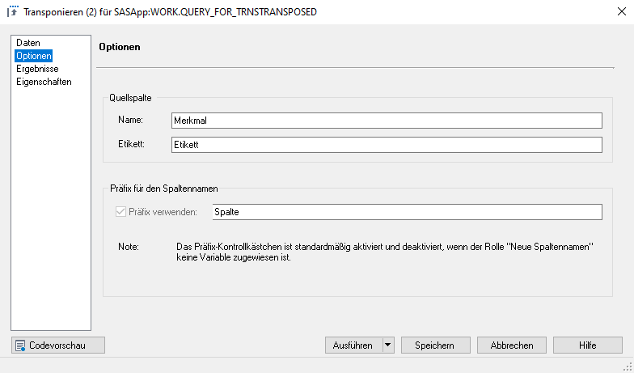

Transponieren
=============

* * *

Die Anwendungsroutine «Transponieren» ermöglicht es, die Struktur eines Datensatzes zu ändern. Der Datensatz kann entweder vertikal oder horizontal strukturiert sein.

Beispiel: Ein Datensatz enthält für jede Person drei numerische Variablen - das Alter, die Grösse und das Gewicht.

*   In der _vertikalen_ Form sind die Werte für Alter, Grösse und Gewicht alle untereinander, also in einer Variable, erfasst. Für jede Person im Datensatz sind also drei Beobachtungen vorhanden.  
    
*   In der _horizontalen_ Form sind die Werte auf drei verschiedene Variablen aufgeteilt, folglich existiert nur eine Beobachtung pro Person.  
    

Horizontalisierung
------------------

Liegen die Daten in der vertikalen Form vor, werden aber für die Weiterverarbeitung in der horizontalen Form gebraucht, so kann das mittels «Transponieren» erreicht werden.  
  
                     **↓**  

#### Lösungsweg SAS Enterprise Guide

_Schritt 1_: Anwendungsroutine «Transponieren» auswählen. Wo diese im neuen SAS Enterprise Guide zu finden ist, kann [hier](neweg.html) nachgelesen werden. 

_Schritt 2_: Die Variablen den richtigen Rollen zuordnen:

*   `Variable transponieren`: Hier muss die Analysevariable ausgewählt werden, deren Werte auf verschiedene Spalten aufgeteilt werden sollen. In diesem Beispiel also _Wert_.
*   `Neue Spaltennamen (Maximal: 1)`: Hier wird die Variable ausgewählt, deren Ausprägungen die neuen Variablen bilden bzw. benennen sollen. In diesem Beispiel also _Merkmal_.
*   `Analyse gruppieren nach`: In diesem Beispiel die Variablen _Name_ und _Geschlecht_. Hier können auch noch mehr Variablen gewählt werden, z.B. wenn der Wert nicht nur nach Name und Geschlecht, sondern z.B. auch noch nach Nationalität ausgewiesen wird.

  
_Schritt 3_: Das Häkchen bei «Präfix verwenden» rausnehmen, damit die neuen Spaltennamen nicht mit dem Wort «Spalte» (Default) ergänzt werden.  

Vertikalisierung
----------------

Liegen die Daten in der horizontalen Form vor, werden aber für die Weiterverarbeitung in der vertikalen Form gebraucht, so kann das ebenfalls mittels «Transponieren» erreicht werden.  
  
                     **↓**  

#### Lösungsweg SAS Enterprise Guide

_Schritt 1_: Anwendungsroutine «Transponieren» auswählen. 

_Schritt 2_: Die Variablen den richtigen Rollen zuordnen:

*   `Variable transponieren`: Hier müssen die Analysevariablen ausgewählt werden, deren Werte in einer Spalte zusammengefasst werden sollen. In diesem Beispiel also _Alter_, _Grösse_ und _Gewicht_.
*   `Analyse gruppieren nach`: In diesem Beispiel die Variablen _Name_ und _Geschlecht_. Hier können auch noch mehr Variablen gewählt werden, z.B. wenn der Wert nicht nur nach Name und Geschlecht, sondern z.B. auch noch nach Nationalität ausgewiesen würde.  
      
    _Schritt 3_: Namen für Quellspalte setzen, in diesem Fall soll sie _Merkmal_ heissen. 

* * *
